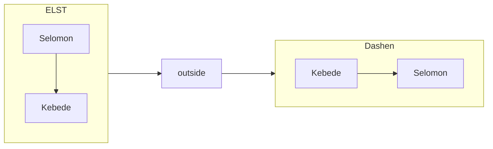
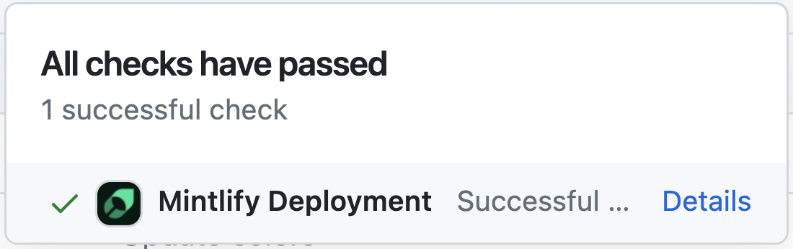

## Hello
### Hello i want to be next to you


[`Roba`](http://google.com) This **central portal** docs the internal bank feature This central portal docs the internal bank feature This central portal docs the internal bank feature


<Info>This central portal docs the internal bank feature</Info>


<Note>This adds a note in the content</Note>


<Warning>This raises a warning to watch out for</Warning>


<Tip>This suggests a helpful tip</Tip>


<Check>This brings us a checked status</Check>


<CardGroup cols={2}>
  <Card title="First Card" icon="square-1" href="/content/components/card-group">hello</Card>
  <Card title="Second Card" icon="square-2">hello</Card>
  <Card title="Third Card" icon="square-3">hello</Card>
</CardGroup>


<Accordion title="I am an Accordion." >
  You can put any content in here.
</Accordion>


<AccordionGroup>
  <Accordion title="FAQ without Icon">
    You can put other components inside Accordions.

    ```java HelloWorld.java
    class HelloWorld {
        public static void main(String[] args) {
            System.out.println("Hello, World!");
        }
    }
    ```

  </Accordion>

  <Accordion title="FAQ with Icon" icon="alien-8bit">
    Check out the [Accordion](/content/components/accordions) docs for all the supported props.
  </Accordion>

  <Accordion title="FAQ without Icon">
    Check out the [Accordion](/content/components/accordions) docs for all the supported props.
  </Accordion>
</AccordionGroup>


<Card title="Click on me" icon="link" href="/content/components/card-group">
  This is how you use a card with an icon and a link. Clicking on this card
  brings you to the Card Group page.
</Card>


```javascript Code Block Example
const hello = "world";
```


<CodeGroup>

```javascript helloWorld.js
console.log("Hello World");
```

```python hello_world.py
print('Hello World!')
```

```java HelloWorld.java
class HelloWorld {
    public static void main(String[] args) {
        System.out.println("Hello, World!");
    }
}
```

</CodeGroup>


<Icon icon="check" iconType="solid" /> The documentation you want, effortlessly





<Steps>
  <Step title="First Step">
    These are instructions or content that only pertain to the first step.
  </Step>
  <Step title="Second Step">
    These are instructions or content that only pertain to the second step.
  </Step>
  <Step title="Third Step">
    These are instructions or content that only pertain to the third step.
  </Step>
</Steps>


<Tabs>
  <Tab title="First Tab">
    ☝️ Welcome to the content that you can only see inside the first Tab.
  </Tab>
  <Tab title="Second Tab">
    ✌️ Here's content that's only inside the second Tab.
  </Tab>
  <Tab title="Third Tab">
    💪 Here's content that's only inside the third Tab.
  </Tab>
</Tabs>


<Tooltip tip="This is a tooltip!">Hover over me</Tooltip>


<Update label="2024-10-12" description="v0.1.1">
  This is how you use a changelog with a label 
  and a description.
</Update>


<Update label="2024-10-11" description="v0.1.0">
  This is how you use a changelog with a label 
  and a description.
</Update>


<ParamField path="param" type="string">
  An example of a parameter field
</ParamField>


<ResponseField name="response" type="string" required>
  A response field example
</ResponseField>


<ResponseField name="user" type="User Object">
  <Expandable title="properties">
    <ResponseField name="full_name" type="string">
      The full name of the user
    </ResponseField>

    <ResponseField name="is_over_21" type="boolean">
      Whether the user is over 21 years old
    </ResponseField>
  </Expandable>
</ResponseField>


{/* <ResponseExample>
```json Response
{ "status": "success" }
```
</ResponseExample> */}


<CodeGroup>
```json Sidebar tabs
"navigation": {
    "tabs": [
      {
        "tab": "Docs",
        "groups": [
          {
            "group": "Get Started",
            "pages": [
              "introduction",
              "central-portal",
              "branches-portal",
              "merchant-portal",
              "customizations"
            ]
          },
          {
            "group": "Essentials",
            "pages": [
              "essentials/markdown"
            ]
          }
        ]
      },
      {
        "tab": "Api Reference",
        "groups": [
          {
            "group": "Get Started",
            "pages": [
              "introduction",
              "central portal",
              "branches portal",
              "merchant portal",
              "customizations"
            ]
          },
          {
            "group": "Essentials",
            "pages": [
              "essentials/markdown"
            ]
          }
        ]
      }
    ]
  },
```


```json sidebar dropdown
"navigation": {
  "dropdowns": [
    {
      "dropdown": "Central Portal",
      "icon": "book-open",
      "pages": [
        "introduction",
        "development",
        "navigation"
      ]
    }
    {
      "dropdown": "Branch Portal",
      "icon": "sqaure-terminal",
      "pages": [
        "api-reference/get",
        "api-reference/post",
        "api-reference/delete"
      ]
    }
    {
      "dropdown": "Merchant Portal",
      "icon": "sqaure-terminal",
      "pages": [
        "api-reference/get",
        "api-reference/post",
        "api-reference/delete"
      ]
    }
  ]
}
```


```json sidebar anchors
"navigation": {
  "anchors": [
    {
      "anchor": "Documentation",
      "icon": "book-open",
      "pages": [
        "quickstart",
        "development",
        "navigation"
      ]
    }
    {
      "anchor": "API References",
      "icon": "sqaure-terminal",
      "pages": [
        "api-reference/get",
        "api-reference/post",
        "api-reference/delete"
      ]
    }
    {
      "anchor": "Blog",
      "href": "https://external-link.com/blog"
    }
  ]
}
```
</CodeGroup>





1. First item
2. Second item
3. Third item
4. Fourth item


- First item
- Second item
  - Additional item
  - Additional item
- Third item


| Property | Description                           |
| -------- | ------------------------------------- |
| Name     | Full name of user                     |
| Age      | Reported age                          |
| Joined   | Whether the user joined the community |


> Minimum TypeScript version: `v4.5.2`